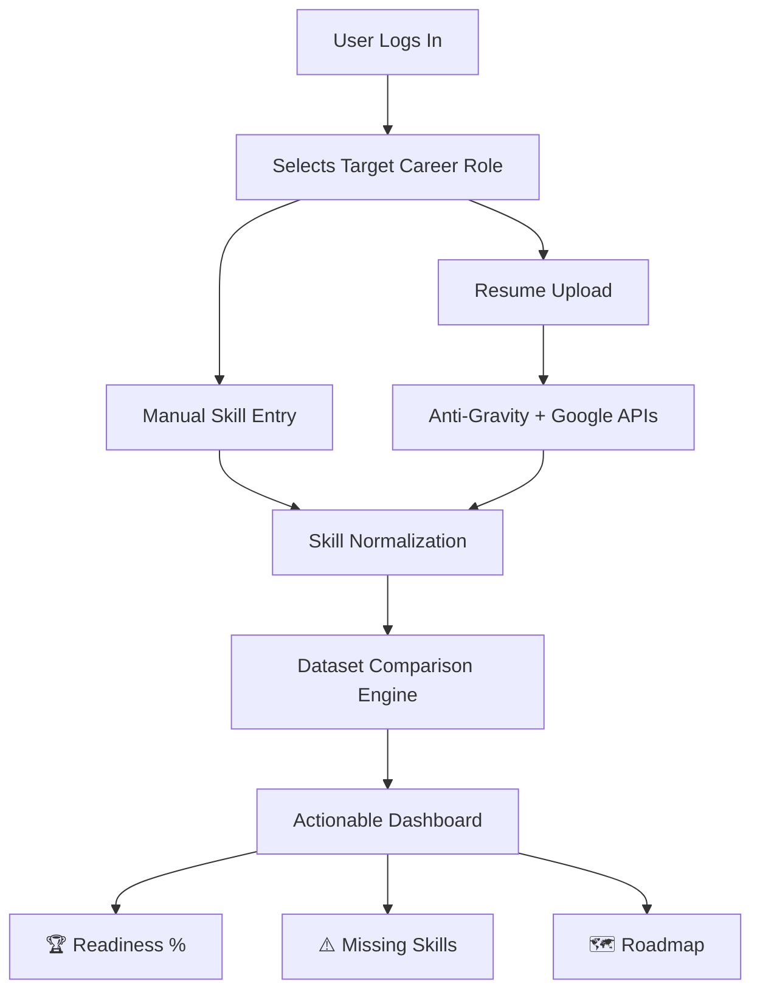

<div align="center">

# 🧠 SkillSenpai

**The Data-Driven Career Readiness Engine**

[](#)
[](#)
[](#)
[](#)

> *SkillSenpai is not just a recommendation tool. It is a career calibration system. It quantifies readiness, eliminates ambiguity, and replaces guessing with structured, data-driven evaluation.*

[Features](#-key-features) • [How It Works](#-how-it-works-system-flow) • [The Algorithm](#-the-readiness-engine) • [Installation](#-quick-start) • [Future Scope](#-roadmap--future-scope)

</div>

---

## 🎯 The Core Objective

Most students and career transitioners fall into a common trap: they overestimate their readiness, learn skills randomly, and fail to align with actual job-market requirements. 

**SkillSenpai enforces structured alignment.** It acts as a recommendation engine, resume intelligence layer, and structured dataset comparator to tell you exactly where you stand and what you need to learn next.

---

## ✨ Key Features

* **📊 Quantified Readiness:** Generates a real-world readiness percentage based on weighted industry requirements.
* **🔍 Skill Gap Intelligence:** Classifies missing skills into Critical, Competitive, and Trending tiers.
* **📄 AI Resume Parsing:** Integrates Anti-Gravity & Google APIs to extract and normalize your existing toolkit automatically.
* **🗺️ Automated Roadmaps:** Builds a sequential learning path from Foundation to Advanced Specialization.
* **📈 Market Demand Insights:** Highlights what the industry actually wants right now.

---

## ⚙️ How It Works (System Flow)



---

## 🧮 The Readiness Engine

SkillSenpai doesn't just do a simple 1:1 match. It uses a **Weighted Scoring Model**.

**Base Formula:**
`Readiness % = (Weighted Matched Skills / Total Weighted Required Skills) × 100`

**Internally, the engine computes:**
- **Core Skill Weight:** Essential to the job function.
- **Secondary Skill Weight:** Supportive but not a dealbreaker.
- **Industry Trend Weight:** Modern tools that boost employability.
- **Market Demand Multiplier:** Real-time necessity scoring.

---

## 🔍 Skill Gap Detection Model

Instead of a raw list of missing skills, SkillSenpai intelligently categorizes gaps:

| Category | Meaning | Impact |
| :--- | :--- | :--- |
| **🚨 Critical Gap** | Must-have skills currently missing. | Blocks employability. |
| **⚔️ Competitive Gap** | Needed for a strong, standout profile. | Lowers interview chances. |
| **📈 Market Trending** | High-demand modern tools & frameworks. | Reduces competitive edge. |
| **🧠 Advanced Layer** | Differentiator skills for senior trajectory. | Limits immediate promotion. |

---

## 🖥️ Dashboard Output Example

When analysis is complete, the user receives a highly structured calibration report:

**🛡️ Role: Cybersecurity Analyst (Red Teaming)**
- **Overall Readiness:** 63%
- **🚨 Missing Critical Skills:**
    - Active Directory Exploitation
    - Privilege Escalation Techniques
    - Network Enumeration
- **🎯 Recommended Focus:**
    - Linux Internals
    - Scripting (Python/Bash)
    - SIEM Understanding
- **📈 Market Demand Insight:**
    - High demand for Cloud Security implementation.
    - Increasing requirement for automated penetration testing workflows.

---

## 🏗️ Tech Stack

- **Frontend Ecosystem:** React (Vite), JavaScript, HTML5, modern CSS.
- **Logic & Computation:** Weighted comparison algorithms, custom JSON dataset engine.
- **API Integrations:** Anti-Gravity API, Google API (for parsing & normalization).
- **Data Persistence:** LocalStorage, `dataset.json`.

---

## 🚀 Quick Start

Get SkillSenpai running locally in seconds.

```bash
# 1. Clone the repository
git clone https://github.com/your-username/Skill-Senpai.git

# 2. Navigate into the directory
cd Skill-Senpai

# 3. Install dependencies
npm install

# 4. Start the development server
npm run dev
```

---

## 📁 Project Structure

```plaintext
Skill-Senpai/
├── public/                 # Static assets
├── src/
│   ├── assets/             # Images, icons, global styles
│   ├── components/         # Reusable React components (UI elements)
│   ├── pages/              # Main view containers (Dashboard, Input)
│   ├── services/           # API integration and external calls
│   └── utils/              # Scoring algorithms & logic helpers
├── dataset.json            # Core skill correlation matrix
├── index.html              # Entry point
└── package.json            # Dependencies & scripts
```

---

## 🔮 Roadmap & Future Scope

SkillSenpai is continuously evolving. Our immediate roadmap includes:

- [ ] **Live Job Scraping:** Integrating real-time market requirements.
- [ ] **ML-Based Scoring:** Upgrading from static weights to dynamic, trained evaluation.
- [ ] **ATS Simulator:** Scoring resumes exactly how enterprise applicant tracking systems do.
- [ ] **Peer Telemetry:** Anonymized percentiles to compare readiness against other users.
- [ ] **Skill Simulation:** Interactive mini-assessments to prove skill proficiency.

<div align="center">

**Quantify your readiness. Map your future.**

Built with ☕ by [Your Name/Team]

</div>
